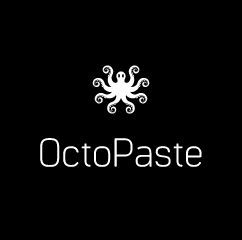

<p align="center">
  
 </p>
<h3 align="center">A visible, persistent and more forgiving clipboard.</h3>

Whiteboard screencasting is all the rage for creating educational videos like those featured in the Khan Academy.
The high cost of the input devices used by the tutors for making of these videos, makes it infeasible for the amateur tutors to make a online tutorial.
FrugalDoodle is our attempt at helping the tutors to create their own tutorials at a very efficient cost.
The other applications of the project are in business meetings and presentations.

-greater copy efficiency : The gain in time accumulates with the number of discrete parts. 37s for 4 lines vs 23s for 4 lines of text. If *t* is the time for switching active windows and *n* is the number of discrete sections of text to be copied, the total time saved is around *(n-1)xt*, which is assuming that the source and destination remain fixed.

-making cohesive notes from multiple documents made easier : copy multiple portions of text independently from multiple documents, without having to change your active window to paste the previously copied text, a faster and hassle-free way to extract what is essential.

-copying code from multiple links : eliminate the frustration of having borrowed a code snippet or workaround from a browser tab, losing it by mis-typing or copying something else, only to realise you've 

-greater fault tolerance for pressing the wrong hotkeys

-greater visibility : select which of the sections of copied text you want to paste on-the-fly and never get it wrong

-persistent history : make your clipboard history persistent across sessions and shutdowns for easier recovery.

-cross-platform : support for efficient text manipulation on Windows as well as Linux systems.

-fully-functional on all popular text-crunching tools: Office, LibreOffice, Sublime Text and more.

## Dependencies

For executing the desktop app, the following packages must be installed:
* a
* b

Use pip3 to install the requirements:

```sh
$ pip3 install -r requirements.txt
```

After installing run the following command in the desktop directory: 
The latest version is in : withui/octopaste.py

```sh
$ python3 octopaste.py
```


## Usage


## Demonstration

Click the below video to view an example of the usage:

[](youtube link here)

## Coming Soon:

File System manipulation made easier with a similar approach.

## Contributors
* Chirag Trasikar - [chirag16](https://github.com/chirag16)
* Ankit Shah - [ankitcshah14](https://github.com/ankitcshah14)
* Arpita Hegde - [arpitahegde414](https://github.com/arpitahegde414)
* Apoorva Gokhale - [apoorva-21](https://github.com/apoorva-21)
